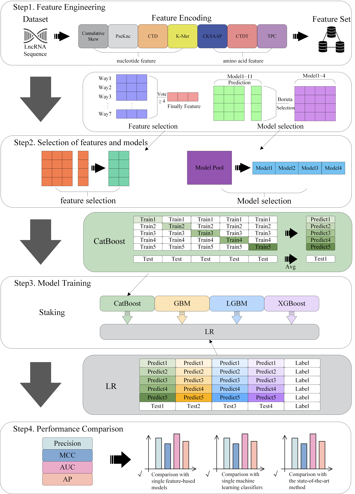

# LncSL
## Introduction
LncSL is a tool designed for predicting the subcellular localization of long non-coding RNAs (lncRNAs) in humans. LncRNAs, which are RNA molecules exceeding 200 nucleotides in length, play crucial roles in various cellular processes. Understanding the subcellular localization of lncRNAs is essential for elucidating their functions and regulatory mechanisms. LncSL utilizes machine learning algorithms to accurately predict the subcellular positions of lncRNAs based on their sequence information.

## Features
- Utilizes machine learning algorithms for predicting subcellular localization.
- Considers both lncRNA sequence and amino acid sequence features.
- Implements feature selection algorithms for optimal model performance.
- Provides an automated model selection method for generating the final prediction model.

## Requirements
- Bio==1.5.9
- Biopython==1.81
- Boruta==0.3
- Catboost==1.2.1
- Genism==4.2.0
- Lightgbm==4.1.0
- Mlxtend==0.23.0
- Numpy==1.21.6
- Orfipy==0.0.4
- Pandas==1.3.5
- Python==3.7.16
- scikit-learn==1.0.2

## Usage
### Simple Usage
To train the model, use the following command:
`python3 main.py`
### Training Your Own Model
1. Extract the feature matrix by running `features.py`:`python3 features.py`
2. Optionally perform feature selection by running `multi_feature_select.py`:`python3 multi_feature_select.py`
3. Perform automatic model selection to obtain stacked models by running `Automatic_model_selection.py`:`python3 Automatic_model_selection.py`
4. Train your own model by replacing the model in `model_pool` in the `main.py` file and running:`python3 main.py`

## Independent Test Set
The `Independent.txt` file in the `data` folder serves as an independent test set for comparison with other existing predictors.

## Additional Details
For more information, refer to the accompanying paper and code repository.
